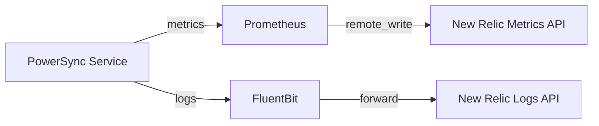

# New Relic Integration

This is a simple setup to monitor the PowerSync service using New Relic. More details on the metrics and logs we expose can be found in [METRICS.md](./METRICS.md).

## Overview

This integration forwards both logs and metrics from PowerSync to New Relic, allowing you to monitor service health and debug issues.



- Prometheus scrapes metrics from PowerSync and forwards them to New Relic.
- Fluent Bit captures PowerSync logs (from docker) and forwards them to New Relic.

## Components

### Prometheus (metrics)

PowerSync exposes Prometheus compatible metrics at the `/metrics` endpoint.
Prometheus scrapes these metrics and sends them to New Relic’s Metrics API using a `remote_write` configuration.

You can read more about what our telemetry exposes [here](https://docs.powersync.com/self-hosting/lifecycle-maintenance/telemetry) or about our metrics exporting [here](https://docs.powersync.com/self-hosting/lifecycle-maintenance/metrics)

### Fluent Bit (logs)

Forwards container logs to New Relic’s Logs API.
Configured as the logging driver for the PowerSync service.

New Relic log forwarding docs can be found [here](https://docs.newrelic.com/docs/logs/forward-logs/enable-log-management-new-relic/)

---

## Prerequisites

- [Docker](https://docs.docker.com/get-docker/) and [Docker Compose](https://docs.docker.com/compose/install/) installed.
- A New Relic account and [license key](https://docs.newrelic.com/docs/apis/intro-apis/new-relic-api-keys/).

---

## Usage

1. Copy the `.env.template` to `.env` and update the New Relic license key.

   ```bash
   cp .env.template .env
   ```

2. Copy the `prometheus.template.yaml` to `prometheus.yaml` and update the New Relic license key.

   ```bash
   cp prometheus.template.yaml prometheus.yaml
   ```

3. Start the stack:

    ```bash
    docker compose up -d
    ```

---

## Verification

- **Logs**: In the New Relic UI, go to *Logs* and search for `powersync` (from the log tag).
- **Metrics**: In *Metrics Explorer*, search for `powersync_*`.

If you see metrics and logs streaming in, the integration is working.

---

## Troubleshooting

- **No logs in New Relic?**
  Check `fluent-bit` container logs with:

  ```bash
  docker logs fluent-bit-forwarder
  ```

- **No metrics in New Relic?**
  Ensure Prometheus is scraping PowerSync:

  ```bash
  curl http://localhost:${PS_TELEMETRY_PORT}/metrics
  ```

- **Port conflicts**
  Make sure the ports (`8080`, `9090`, `24224`, `5432`, `6060`) are free.

---

## Included Services (from `compose.yaml`)

- `powersync` – PowerSync service with telemetry enabled.
- `fluent-bit` – forwards logs to New Relic.
- `prometheus` – scrapes PowerSync metrics and pushes them to New Relic.
- `pg-db` – Postgres database.
- `demo-backend` – sample Node.js backend that uses PowerSync.

---

## Next Steps

- Customize Prometheus scrape targets if you run multiple PowerSync instances.
- Use [New Relic dashboards](https://docs.newrelic.com/docs/query-your-data/explore-data/dashboards/introduction-dashboards/) to visualize metrics and logs.
- Set up alerts for key metrics like latency, queue size, or error rate.
